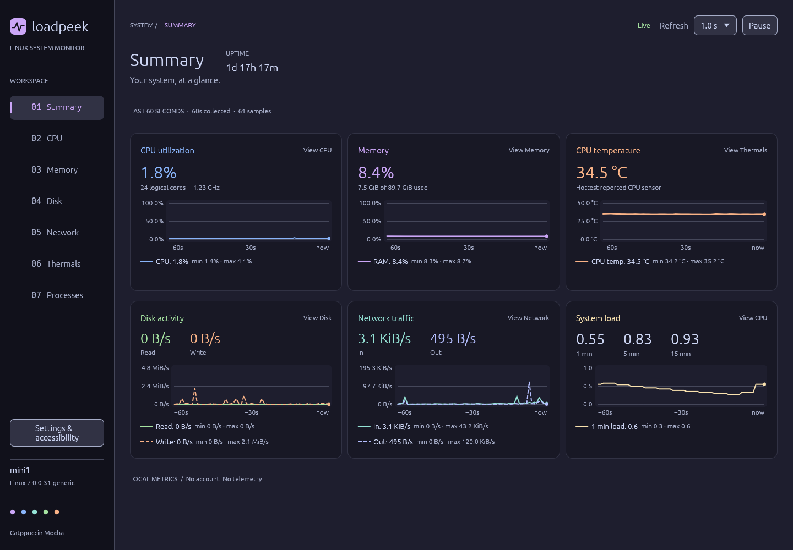

# Loadpeek

A native Linux system monitor written in Rust, with a [Catppuccin Mocha](https://catppuccin.com/palette/) interface. Live values and one-minute line charts show system activity at a glance.



## Install from the main branch

With **Rust 1.95 or newer** and Cargo installed, plus the [Linux dependencies](#linux-dependencies), install directly from GitHub:

```sh
cargo install --git https://github.com/lab1702/loadpeek --branch main --locked
```

Cargo builds Loadpeek from source and installs it to `~/.cargo/bin` by default. Ensure that directory is on your `PATH`, then run `loadpeek` in a Linux desktop session. Run the same install command again to update to the latest code on `main`.

## Build and run

Use **Rust 1.95 or newer** with Cargo, a C compiler/linker, and a Linux desktop session. The GUI uses egui/eframe with the Glow OpenGL renderer and both X11 and Wayland support.

From the project directory:

```sh
cargo run --release
```

To build without launching:

```sh
cargo build --release
```

The binary is `target/release/loadpeek`. Run it as your regular desktop user. Metrics come from readable `/proc` and `/sys` files; no privileged service is needed. No telemetry is transmitted. The first build downloads Rust dependencies through Cargo.

### Linux dependencies

The runtime needs an X11 or Wayland session, its client libraries, xkbcommon, and a working OpenGL/EGL driver. A desktop installation commonly provides these already. A headless shell alone cannot display the application.

For Debian 13, these packages cover common build prerequisites for both window backends:

```sh
sudo apt install build-essential pkg-config libwayland-dev libxkbcommon-dev \
  libxcb-render0-dev libxcb-shape0-dev libxcb-xfixes0-dev
```

The compiler and discovery tools are documented in Debian's [build-essential](https://packages.debian.org/trixie/build-essential) and [pkg-config](https://packages.debian.org/trixie/pkg-config) packages. The graphics development packages follow the [upstream eframe Linux instructions](https://github.com/emilk/egui/tree/main/crates/eframe#readme), with [Wayland development files](https://packages.debian.org/trixie/libwayland-dev) for Wayland support.

For runtime troubleshooting, Debian provides [libgl1](https://packages.debian.org/trixie/libgl1), [libegl1](https://packages.debian.org/trixie/libegl1), and [libxkbcommon-x11-0](https://packages.debian.org/trixie/libxkbcommon-x11-0). Your graphics driver must also provide the actual OpenGL implementation; [Mesa DRI modules](https://packages.debian.org/trixie/libgl1-mesa-dri) are one option. Other distributions use different package names. Loadpeek does not install packages or drivers.

## Pages

| Page | What it shows |
| --- | --- |
| **Summary** | The first page: CPU utilization and minimum/average/maximum clock, RAM usage, disk read/write, network in/out, CPU temperature, load averages, and uptime. Each card opens its detail page. |
| **CPU** | Overall utilization, minimum/average/maximum clock history, 1/5/15-minute load averages, and a utilization chart plus current clock for every online logical core. A core filter helps on large systems. |
| **Memory** | RAM and swap utilization histories, total memory, available memory, used memory, and reclaimable cache. |
| **Disk** | Combined or selected-device read/write history, current rates, and lifetime counters for detected whole block devices, with duplicate accounting layers excluded. |
| **Network** | Combined or selected-interface incoming/outgoing history, current rates, interface state, and lifetime byte counters. |
| **Thermals** | The hottest recognized CPU sensor and individual hardware temperature histories, with critical thresholds when the driver reports them. |
| **Processes** | A sortable, filterable process table with PID, user, priority, nice value, virtual/resident/shared memory, state, CPU%, memory%, CPU time, and command. Select a row for full process details. |

Layouts reduce their column count as space narrows. Detail pages scroll when their content exceeds the window. Paired throughput charts use named solid and dashed lines as well as different colors.

## Refresh, history, and settings

Choose a refresh interval in the toolbar from **0.5 to 5.0 seconds**, in **0.5-second steps**. The default is one second. Collection runs outside the UI thread.

Charts cover the last **60 real seconds**, independent of the chosen refresh rate. Collection and history updates continue while the window is minimized. History starts empty and fills as the application collects measurements; it is not loaded from before launch. CPU utilization and throughput need two valid readings, so their first sample has no rate. Missing readings and counter resets create gaps instead of zero-valued activity.

Chart inspection keeps the selected observation as new samples arrive and preserves selection and keyboard focus when resizing rearranges the charts. When that observation expires, selection moves to the oldest remaining point.

**Pause** freezes collection and the displayed history. **Resume** starts a fresh history and primes rate counters again. Closing the application discards history.

Open **Settings & accessibility** to change interface size from **100% to 200%**, in 25% steps. Refresh interval and interface scale are saved automatically to:

```text
$XDG_CONFIG_HOME/loadpeek/settings.json
```

If `XDG_CONFIG_HOME` is unset, empty, or relative, the location is `$HOME/.config/loadpeek/settings.json`. Invalid settings fall back to safe defaults, and read/write problems appear in the application's notices.

### Keyboard controls

| Shortcut | Action |
| --- | --- |
| `Alt+1` | Summary |
| `Alt+2` | CPU |
| `Alt+3` | Memory |
| `Alt+4` | Disk |
| `Alt+5` | Network |
| `Alt+6` | Thermals |
| `Alt+7` | Processes |
| `Alt+P` | Pause or resume |
| `Alt+S` | Toggle settings |
| `Tab` / `Shift+Tab` | Move between controls |
| `Enter` / `Space` | Activate the focused control |
| Arrow keys | Navigate open menus |
| Left / Right on a focused chart | Inspect the previous / next historical sample |
| Home / End on a focused chart | Jump to the oldest / newest sample |
| Escape on a focused chart | Leave chart inspection |
| Up / Down on a focused process row | Select the previous / next process |
| Page Up / Page Down on a focused process row | Move through the process list one page at a time |
| Home / End on a focused process row | Select the first / last matching process |

Your desktop or window manager may reserve an Alt shortcut before it reaches the application. The corresponding on-screen controls remain available.

## Metric definitions

### CPU and load

CPU percentages use differences between `/proc/stat` samples. The overall value is normalized to **100% for the entire machine**, and each logical core also has a 0–100% scale. Idle and I/O-wait time are excluded; steal time is included. Guest time is already part of the kernel's user/nice counters and is not added again. A decrease in an ordinary counter invalidates that interval; a decrease in I/O-wait is clamped because Linux permits that counter to fall. See the kernel's [/proc/stat documentation](https://docs.kernel.org/filesystems/proc.html#miscellaneous-kernel-statistics-in-proc-stat).

Load averages are the kernel's 1-, 5-, and 15-minute averages of runnable or uninterruptible tasks, read from `/proc/loadavg`. They are task counts, not CPU percentages. Compare them with the number of logical cores, while remembering that I/O waits also contribute. Uptime comes from `/proc/uptime`.

Clock readings prefer `cpuinfo_cur_freq`, then `scaling_cur_freq`, then `/proc/cpuinfo`'s `cpu MHz`. The CPU minimum, average, and maximum are calculated across cores with an available, finite, positive reading in each sample. Clock history tracks all three statistics for each sample. Individual core readouts show that core's current frequency. A scaling-driver reading may describe its requested frequency rather than the exact instantaneous hardware clock; availability and meaning depend on the driver. See [CPU performance scaling](https://docs.kernel.org/admin-guide/pm/cpufreq.html).

### Memory

Used RAM is `MemTotal − MemAvailable`. Available RAM includes memory the kernel estimates it can reclaim, so it differs from completely free memory. If `MemAvailable` is absent, Loadpeek estimates availability from free memory, buffers, and reclaimable cache and displays a notice. Cache is `Cached + SReclaimable − Shmem`, clamped to valid bounds; it overlaps the other accounting categories and should not be added to used and available memory. Swap use is `SwapTotal − SwapFree`. Linux `kB` values are converted as 1,024 bytes. These fields are described in the kernel's [/proc memory documentation](https://docs.kernel.org/filesystems/proc.html#meminfo).

### Disk and network

Read/write and incoming/outgoing rates are counter deltas divided by the actual elapsed monotonic time, in **bytes per second**. Displayed KiB, MiB, and GiB use powers of 1,024. Rates are interval averages, so brief bursts between samples are smoothed. Decreasing counters, new devices, and an unreadable source require a fresh baseline before rates resume.

Disk counters come from `/proc/diskstats`. Sectors are always converted using 512 bytes, regardless of the device's physical sector size. Discovery through `/sys/block` excludes partitions, loop devices, RAM disks, zram, stacked devices with slaves, and hidden devices. For native NVMe multipath, the visible namespace is retained and its hidden controller paths are excluded, so their shared traffic contributes once. An unreadable or invalid visibility flag omits that device with a notice; kernels without the flag retain the usual topology checks. This measures whole-device I/O without summing duplicate accounting layers. It is disk I/O throughput, not filesystem space usage. See the kernel's [block statistics](https://docs.kernel.org/block/stat.html) and [I/O statistics fields](https://docs.kernel.org/admin-guide/iostats.html).

Disk generations from `/sys/block/<device>/diskseq` distinguish replacement drives that reuse a device name. Identity is checked before and after reading counters; a replacement needs a fresh rate baseline. If the kernel or sysfs view does not expose a valid disk generation, lifetime counters remain visible, rates are unavailable, and a notice explains why.

Network counters come from `/proc/net/dev`; loopback is excluded. Interface indices identify replacement links even when they reuse a previous name; a replacement starts with a fresh rate baseline. If an interface's identity cannot be read, its lifetime counters remain visible while rates are unavailable. “All interfaces” sums interface traffic, including virtual interfaces. A bridge, VPN, or virtual adapter can observe traffic also counted on another interface, so that sum is not necessarily unique external traffic. Select a specific interface when you need its rate. “Up” primarily reflects the interface's administrative `IFF_UP` flag and does not guarantee Internet connectivity.

A selected disk or network interface stays selected across pause/resume and missing readings. Its selector shows “unavailable” until it returns; choose “All devices” or “All interfaces” to switch back to combined traffic.

### Temperatures and unavailable data

Temperatures come from `/sys/class/hwmon`, with thermal-zone readings used to fill gaps. Driver labels identify channels, and critical limits appear only when reported. Faulted sensor readings are omitted with an availability notice. PECI control targets (Tcontrol, Tthrottle, and Tjmax) are excluded from measured temperatures. The CPU headline is the hottest sensor recognized as belonging to the CPU; recognition depends on driver and channel names. Readable inputs resolving to the same sysfs file are deduplicated. Other readings are retained when their shared identity cannot be proved, so similar driver names or equal temperatures cannot hide an available package sensor. See the [hwmon interface](https://docs.kernel.org/hwmon/sysfs-interface.html) and [PECI channel definitions](https://docs.kernel.org/hwmon/peci-cputemp.html#sysfs-interface).

VT1211 external channels require board-specific conversion and are omitted with a notice; its calibrated internal diode remains available. Loadpeek does not apply `sensors.conf` conversion formulas. See the [VT1211 temperature definitions](https://docs.kernel.org/hwmon/vt1211.html#temperature-monitoring).

For AMD sensors exposing both Tdie and Tctl, the CPU headline prefers the physical Tdie reading over the same device's offset fan-control Tctl value. CCD and other CPU temperatures still contribute to the hottest reading. Tctl remains visible under its driver label and is used as a fallback when that device has no valid Tdie reading. See the [k10temp temperature definitions](https://docs.kernel.org/hwmon/k10temp.html). Legacy hwmon layouts also retain their driver names when attributes are exposed under `device/`.

Some VMs, containers, and hardware drivers do not expose clocks, disks, network interfaces, or temperatures. Loadpeek shows unavailable values and collection notices while continuing to display other measurements. Container views can also mix host-wide and namespace-specific counters; Loadpeek does not reinterpret those values as container resource quotas.

### Processes

The process table samples numeric PID directories in `/proc` on the same background collector and refresh schedule as other metrics. It retains only the current snapshot. Pause freezes the list; resuming primes fresh CPU counters. Rows represent processes (thread groups), with each process's thread count available in its details.

Process CPU usage follows top's usual convention: **100% is one logical core**, and a multithreaded process may exceed 100%. This differs from the Summary page, whose overall CPU percentage is normalized across all logical cores. The rate is the change in user plus system CPU ticks over actual elapsed time, converted using the kernel's clock-tick frequency. TIME+ is cumulative CPU time, not elapsed wall time. A new process, reused PID, or reset counter needs a second valid reading before it has a CPU rate.

RES is resident memory; VIRT is virtual address space; SHR is shared resident memory reported by `statm`. Memory percentage is RES divided by system physical RAM. These kernel accounting values are approximate; summing RES across processes can double-count shared pages. Units use binary multiples. User names resolve from local account records, with a numeric effective UID fallback.

Processes that exit while being sampled are omitted. Linux permissions, `hidepid`, containers, or namespaces may limit the visible list or particular fields; unavailable values are marked instead of fabricated. Selecting a process retains its PID and start-time identity so a reused PID cannot silently replace it in the details view. Command lines come from `cmdline` and are capped at 64 KiB with an ellipsis; kernel threads fall back to their bracketed names. The monitor reads no process environment variables and does not send signals or change process priority.

See the Linux kernel's [process information documentation](https://docs.kernel.org/filesystems/proc.html#process-specific-subdirectories).

## Accessibility

The Mocha palette is used with restricted foreground/background pairings. Unit tests check the chosen text colors against **4.5:1** minimum contrast and chart strokes, focus indicators, and control boundaries against **3:1**, following the relevant [WCAG text contrast](https://www.w3.org/WAI/WCAG22/Understanding/contrast-minimum.html) and [non-text contrast](https://www.w3.org/WAI/WCAG22/Understanding/non-text-contrast.html) criteria. Decorative chart grid lines are not used to convey a value by themselves.

Keyboard navigation, visible focus styling, interface scaling, pause/resume, named chart legends, line patterns, keyboard access to every historical sample, and textual current/minimum/maximum chart summaries support reading and interaction without relying on color alone.

Individual core and sensor charts include their identities in their accessible names. Keyboard focus reveals process sorting controls and rows within the scrollable table and page.

The build enables egui's [AccessKit integration](https://accesskit.dev/) and its Linux platform support. Complete screen-reader behavior still needs manual validation with a Linux screen reader and desktop accessibility services. These are targeted accessibility measures, **not a certification of full WCAG conformance**. A full assessment also needs assistive-technology, keyboard, resizing, and content review across the actual desktop environments where the app will be used.

## Development checks

```sh
cargo fmt --check
cargo test
cargo clippy --all-targets -- -D warnings
```

Tests cover counter parsing, CPU guest accounting, counter resets, variable elapsed intervals, memory calculations, disk topology, missing sources, temperature discovery, real-time history retention, chart gaps/scales, process identity and exit races, process sorting and filtering, settings persistence, and contrast pairings. Desktop rendering and assistive technology still require GUI checks on a running Linux session.

See [the validation record](docs/VALIDATION.md) for the tested environment, native GUI checks, and remaining manual checks.

## Desktop launcher

`packaging/loadpeek.desktop` is a standard launcher template. It expects a `loadpeek` executable on `PATH` and uses the desktop theme's `utilities-system-monitor` icon. Build artifacts and the launcher are provided without automatically installing them.

## License

MIT. See [LICENSE](LICENSE). Catppuccin palette attribution and links are retained above; Rust dependencies retain their respective licenses.
